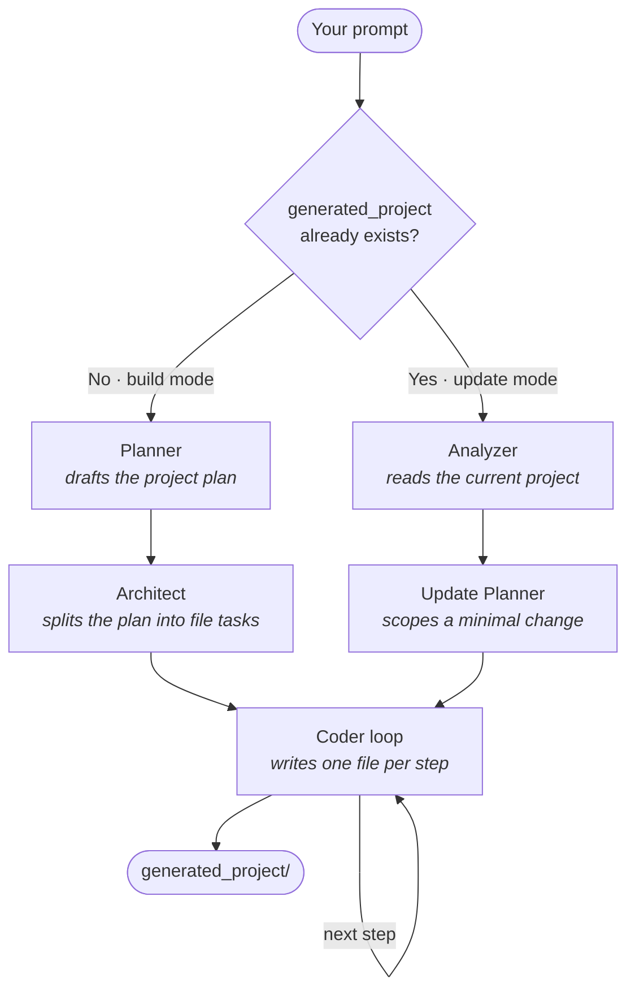

# buildBud

**buildBud** turns a single natural-language prompt into a complete, working codebase — and then keeps evolving it with follow-up requests.

Instead of asking one model to emit a whole app in a single shot, buildBud runs a small team of specialized agents that **plan**, **break the work down**, and **implement it one file at a time** — the way a real development team would. It's built on [LangGraph](https://github.com/langchain-ai/langgraph) and powered by [Groq](https://groq.com/).

---

## Highlights

- **Two modes, one command.** Start with an empty workspace and buildBud *builds* your app from scratch. Run it again on an existing project and it switches to *update* mode, applying your change to the code that's already there.
- **Multi-agent pipeline.** A planner, an architect, and a coder each own one stage of the work, passing structured state down the graph.
- **Incremental, in-place edits.** Update mode reads the current project, plans only the delta, and rewrites just the files that need to change — everything else is preserved.
- **Sandboxed by design.** All file writes are confined to the `generated_project/` directory; path-traversal attempts are rejected.
- **Project memory.** Each run persists its plan to `generated_project/.buildbud/state.json`, so follow-up edits stay consistent with earlier decisions.
- **Resilient coder.** Files are generated as plain text and written directly to disk (no brittle tool-call JSON), and a step that fails after retries is skipped rather than crashing the whole run.

---

## How it works

buildBud is a [LangGraph](https://github.com/langchain-ai/langgraph) state machine with two entry paths, chosen automatically based on whether a project already exists:



**Build mode** — `Planner → Architect → Coder`

1. **Planner** converts your prompt into a structured plan (name, tech stack, features, file list).
2. **Architect** turns that plan into an ordered list of concrete, self-contained implementation tasks — one or more per file.
3. **Coder** walks the task list and generates each file's full contents.

**Update mode** — `Analyzer → Update Planner → Coder`

1. **Analyzer** reads the existing project (file tree + contents, plus the saved plan summary) into a snapshot.
2. **Update Planner** produces a *minimal* task list scoped to only the files your change touches — no full rebuild.
3. **Coder** rewrites those files, preserving all existing functionality.

The **Coder** stage is shared by both paths, so build and update benefit from the same generation logic.

---

## Getting started

### Prerequisites

- **[uv](https://docs.astral.sh/uv/getting-started/installation/)** — the Python package/env manager used by this project.
- **A Groq API key** — create one at [console.groq.com/keys](https://console.groq.com/keys).

### Installation

```bash
# 1. Clone the repo
git clone https://github.com/JayeshGChandan/buildBud.git
cd buildBud

# 2. Install dependencies into a managed virtual environment
uv sync

# 3. Configure your API key
cp .sample_env .env      # then open .env and paste in your GROQ_API_KEY
```

### Run it

```bash
uv run python main.py
```

> The first run works on an **empty** `generated_project/`, so buildBud builds from scratch and prompts you for a project description.

---

## Usage

**Build a new app** (empty workspace):

```
Enter your project prompt: a stopwatch and timer web app with a clean UI
```

**Iterate on it** — just run the same command again. buildBud detects the existing project and switches to update mode:

```
Existing project detected -> UPDATE mode (use --new to rebuild from scratch).
What change would you like to make? add a lap button and a dark-mode toggle
```

It reads the current files, plans only the delta, and edits in place — leaving everything else untouched. Repeat as many times as you like.

### Flags

| Flag | Description |
| --- | --- |
| `--new` | Force a fresh build even if a project already exists (⚠️ overwrites `generated_project/`). |
| `-r`, `--recursion-limit N` | Raise the graph step limit for large projects (default: `100`). |

### Example prompts

- A to-do list app in HTML, CSS, and JavaScript.
- A simple calculator web app.
- A blog API in FastAPI backed by SQLite.
- *(follow-up)* Add form validation and a "clear all" button.

---

## Project structure

```
buildBud/
├── agent/
│   ├── graph.py      # LangGraph wiring: nodes, routing, build & update pipelines
│   ├── states.py     # Pydantic models for plans, tasks, and coder state
│   ├── prompts.py    # Prompt templates for each agent
│   └── tools.py      # Sandboxed file tools + project-context helpers
├── main.py           # CLI entry point (mode detection, flags)
├── pyproject.toml    # Project metadata & dependencies
├── .sample_env       # Template for your .env
└── generated_project/  # ← your generated app lands here (git-ignored)
```

---

## Tech stack

- **[LangGraph](https://github.com/langchain-ai/langgraph)** — agent orchestration as a state graph.
- **[LangChain](https://python.langchain.com/)** — model abstractions and structured output.
- **[Groq](https://groq.com/)** — fast LLM inference (`llama-3.3-70b-versatile` by default).
- **[Pydantic](https://docs.pydantic.dev/)** — typed plans and task schemas.
- **[uv](https://docs.astral.sh/uv/)** — dependency and environment management.

---

## Contributing

Issues and pull requests are welcome. If you're changing agent behavior, please describe the prompt you tested against and the resulting `generated_project/` output.

---

Built by [Jayesh Chandan](https://github.com/JayeshGChandan).
